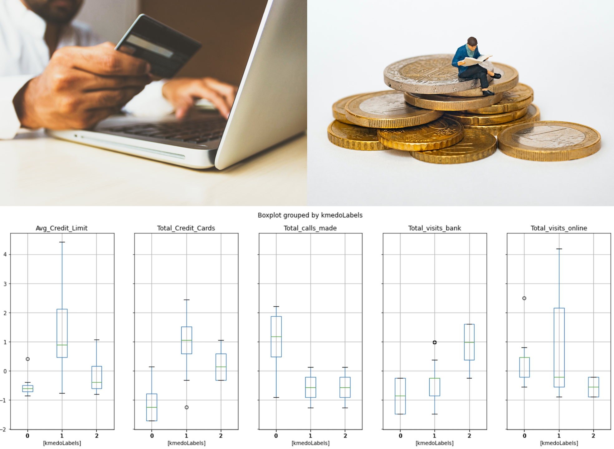
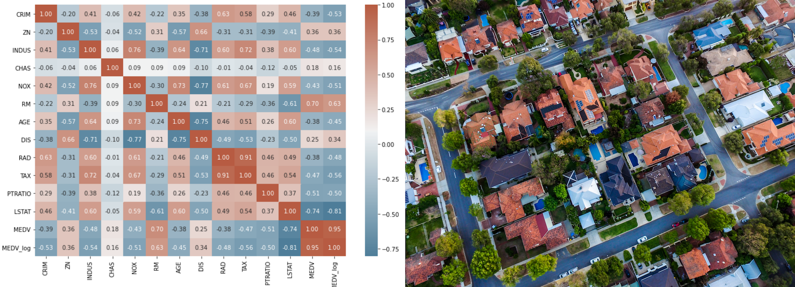
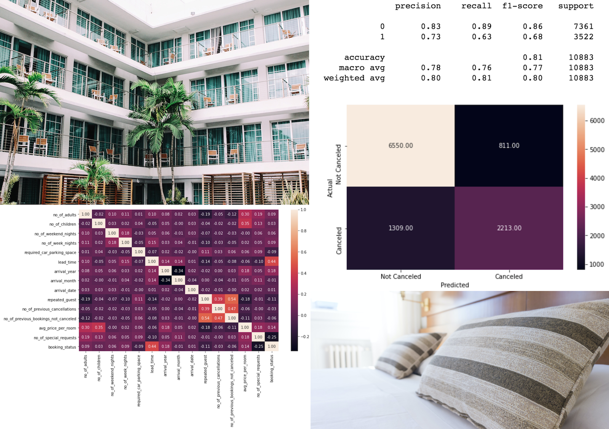
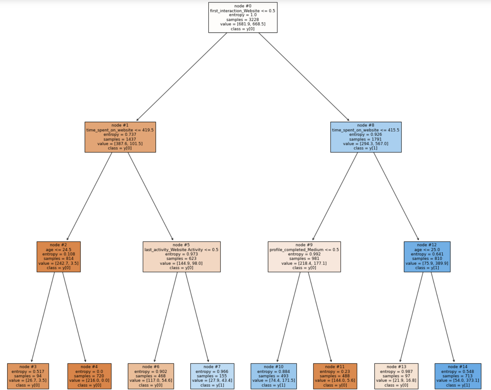
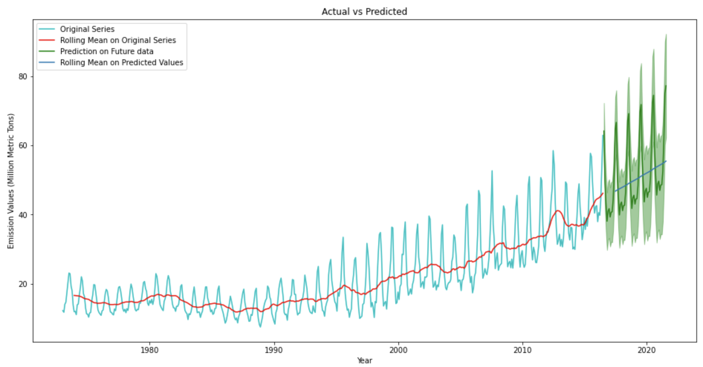
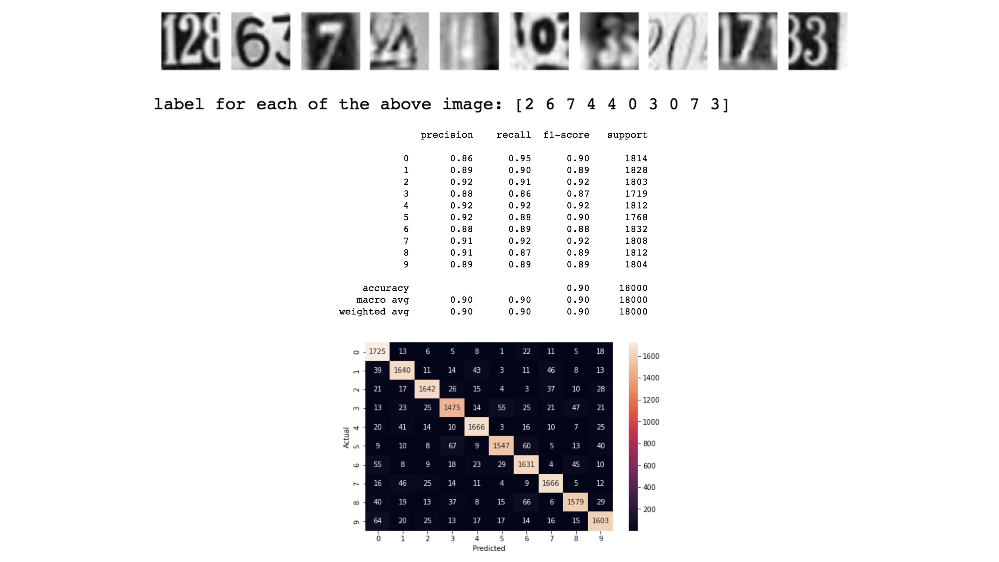

# Portfolio
---
## Foundations of Data Science

### Marketing Campaign Analysis

This project aims to analyse marketing data and address some important business problems/questions related to customer demographics, product preferences, channel performances, etc.

**Skills:** Exploratory Data Analysis, Data Visualization, Statistics

---
## Data Analysis and Visualization

### Dimensional Reduction on Automobile MPG Data

This project involves exploring the automobile mpg dataset by applying dimensionality reduction techniques and visualizing the data in lower dimensions to extract insights.

**Skills:** PCA, t-SNE

 

 

---
### Banking Customer Segmentation 

This project involves segmenting the bank customers to help the bank upgrading the service delivery model and ensure that customers queries are resolved faster.

**Skills:** Unsupervised Learning, Clustering

 

 

---
## Machine Learning

### Predicting Boston Housing Cost 

This project involves predicting the house prices based on the features of the locality using regression techniques.

**Skills:** Linear Regression

 

 

---

### Predicting Hotel Booking Cancellations

This project involves predicting which hotel bookings will result in cancellations using classification algorithms to help the hotel prevent potential losses from last minute cancellations and additional costs to resell rooms.

**Skills:** Logistic Regression, kNN

 

 

---

## Practical Data Science

### Predicting Online Education Enrollment

This project involves predicting the which individuals will enroll in an online education program using classification algorithms.  The classification will allow the online program recruiters to properly allocate resources for potential students.

**Skills:** Decision Trees, Random Forest

 

 

---

### Predicting Natural Gas CO2 Emissions

This project involves predicting the natural gas CO2 emission values using time series analysis.

**Skills:** Time Series

 

 

---

## Deep Learning

### Street Housing Number

- ANN Notebook

- CNN Notebook

This project involves recognizing the street view housing number digit by using artificial and convolutional neural networks.

**Skills:** Artificial Neural Networks, Convolutional Neural Networks

 

 

---

## Recommendation Systems

### Recommending Amazon Products

This project involves recommending the best amazon products available to the users by using some recommendation systems techniques.

**Skills:** Rank Based Recommendation Systems, Similarity Based Recommendation Systems, Matrix Factorization Based Recommendation Systems

 

 

---

## Industry Projects

---
## About Me

---
