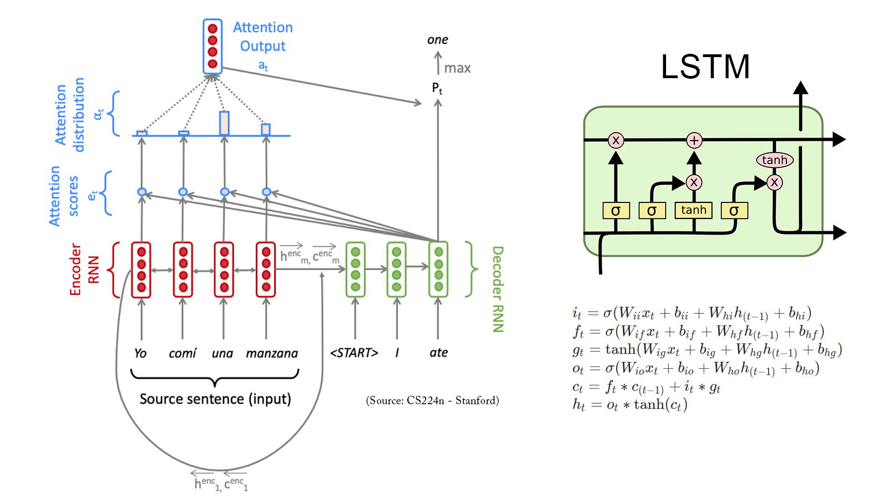

# Portfolio - Work in Progress, Updating Based on https://github.com/chriskhanhtran/minimal-portfolio
---
## Foundations of Data Science

### Marketing Campaign Analysis

This project aims to analyse marketing data and address some important business problems/questions related to customer demographics, product preferences, channel performances, etc.

**Skills:** Exploratory Data Analysis, Data Visualization, Statistics

---
## Data Analysis and Visualization

### Dimensional Reduction on Automobile MPG Data

This project involves exploring the automobile mpg dataset by applying dimensionality reduction techniques and visualizing the data in lower dimensions to extract insights.

**Skills:** PCA, t-SNE

 

 

---
### Banking Customer Segmentation 

This project involves segmenting the bank customers to help the bank upgrading the service delivery model and ensure that customers queries are resolved faster.

**Skills:** Unsupervised Learning, Clustering

 

 

---
## Machine Learning

### Project 1

My complete implementation of assignments and projects in [***CS224n: Natural Language Processing with Deep Learning***](http://web.stanford.edu/class/cs224n/) by Stanford (Winter, 2019).

**Neural Machine Translation:** An NMT system which translates texts from Spanish to English using a Bidirectional LSTM encoder for the source sentence and a Unidirectional LSTM Decoder with multiplicative attention for the target sentence ([GitHub](https://github.com/chriskhanhtran/CS224n-NLP-Solutions/tree/master/assignments/)).

**Dependency Parsing:** A Neural Transition-Based Dependency Parsing system with one-layer MLP ([GitHub](https://github.com/chriskhanhtran/CS224n-NLP-Assignments/tree/master/assignments/a3)).

---

## Practical Data Science

### Project 1

My complete implementation of assignments and projects in [***CS224n: Natural Language Processing with Deep Learning***](http://web.stanford.edu/class/cs224n/) by Stanford (Winter, 2019).

**Neural Machine Translation:** An NMT system which translates texts from Spanish to English using a Bidirectional LSTM encoder for the source sentence and a Unidirectional LSTM Decoder with multiplicative attention for the target sentence ([GitHub](https://github.com/chriskhanhtran/CS224n-NLP-Solutions/tree/master/assignments/)).

**Dependency Parsing:** A Neural Transition-Based Dependency Parsing system with one-layer MLP ([GitHub](https://github.com/chriskhanhtran/CS224n-NLP-Assignments/tree/master/assignments/a3)).

---

## Deep Learning

### Project 1

My complete implementation of assignments and projects in [***CS224n: Natural Language Processing with Deep Learning***](http://web.stanford.edu/class/cs224n/) by Stanford (Winter, 2019).

**Neural Machine Translation:** An NMT system which translates texts from Spanish to English using a Bidirectional LSTM encoder for the source sentence and a Unidirectional LSTM Decoder with multiplicative attention for the target sentence ([GitHub](https://github.com/chriskhanhtran/CS224n-NLP-Solutions/tree/master/assignments/)).

**Dependency Parsing:** A Neural Transition-Based Dependency Parsing system with one-layer MLP ([GitHub](https://github.com/chriskhanhtran/CS224n-NLP-Assignments/tree/master/assignments/a3)).

---

## Recommendation Systems

### Project 1

My complete implementation of assignments and projects in [***CS224n: Natural Language Processing with Deep Learning***](http://web.stanford.edu/class/cs224n/) by Stanford (Winter, 2019).

**Neural Machine Translation:** An NMT system which translates texts from Spanish to English using a Bidirectional LSTM encoder for the source sentence and a Unidirectional LSTM Decoder with multiplicative attention for the target sentence ([GitHub](https://github.com/chriskhanhtran/CS224n-NLP-Solutions/tree/master/assignments/)).

**Dependency Parsing:** A Neural Transition-Based Dependency Parsing system with one-layer MLP ([GitHub](https://github.com/chriskhanhtran/CS224n-NLP-Assignments/tree/master/assignments/a3)).

---

## Industry Projects

Besides Data Science, I also have a great passion for photography and videography. Below is a list of films I documented to retain beautiful memories of places I traveled to and amazing people I met on the way.

 

- [Ada Von Weiss - You Regret (Winter at Niagara)](https://www.youtube.com/watch?v=-5esqvmPnHI)
- [The Weight We Carry is Love - TORONTO](https://www.youtube.com/watch?v=vfZwdEWgUPE)
- [In America - Boston 2017](https://www.youtube.com/watch?v=YdXufiebgyc)
- [In America - We Call This Place Our Home (Massachusetts)](https://www.youtube.com/watch?v=jzfcM_iO0FU)

---
## About Me

Besides Data Science, I also have a great passion for photography and videography. Below is a list of films I documented to retain beautiful memories of places I traveled to and amazing people I met on the way.

 

- [Ada Von Weiss - You Regret (Winter at Niagara)](https://www.youtube.com/watch?v=-5esqvmPnHI)
- [The Weight We Carry is Love - TORONTO](https://www.youtube.com/watch?v=vfZwdEWgUPE)
- [In America - Boston 2017](https://www.youtube.com/watch?v=YdXufiebgyc)
- [In America - We Call This Place Our Home (Massachusetts)](https://www.youtube.com/watch?v=jzfcM_iO0FU)

---
